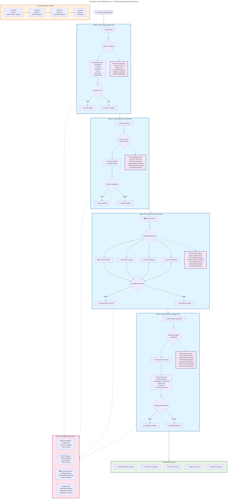

```mermaid
---
title: Computer Vision Roadmap for UI - Technology Implementation Phases
---
flowchart TD
    %% Start node
    START([🚀 Computer Vision Initiative]) --> PHASE1

    %% Phase I - Basic Image Quality Pass
    subgraph PHASE1 ["Phase I: Basic Image Quality Pass"]
        direction TB
        P1_START[📸 Image Input] --> P1_OPENCV{OpenCV Analysis}
        P1_OPENCV --> P1_METRICS[📊 Quality Metrics<br/>• Brightness<br/>• Contrast<br/>• Sharpness<br/>• Noise<br/>• Exposure<br/>• Edge Quality]
        P1_METRICS --> P1_DECISION{Quality Pass?}
        P1_DECISION -->|Pass| P1_ACCEPT[✅ Accept Image]
        P1_DECISION -->|Fail| P1_REJECT[❌ Reject & Retake]
        
        %% Technology Stack for Phase I
        P1_TECH[🛠️ Technology Stack<br/>• OpenCV 4.12.0<br/>• Python 3.11<br/>• FastAPI REST API<br/>• Docker Containers<br/>• AWS Lambda/ECS]
        P1_OPENCV -.-> P1_TECH
    end

    %% Phase II - Odometer Number Identification
    subgraph PHASE2 ["Phase II: Odometer Number Validation"]
        direction TB
        P2_START[🚗 Odometer Photos] --> P2_AZURE{Azure AI Vision<br/>OCR Analysis}
        P2_AZURE --> P2_EXTRACT[🔢 Extract Numbers<br/>1-6 Digits Pattern]
        P2_EXTRACT --> P2_VALIDATE{Number Validation}
        P2_VALIDATE -->|Valid| P2_STORE[💾 Store Reading]
        P2_VALIDATE -->|Invalid| P2_RETRY[🔄 Request Retake]
        
        %% Technology Stack for Phase II
        P2_TECH[🛠️ Technology Stack<br/>• Azure AI Vision 4.0<br/>• OCR Text Extraction<br/>• Regex Pattern Matching<br/>• JSON Response Format<br/>• Confidence Scoring]
        P2_AZURE -.-> P2_TECH
    end

    %% Phase III - Damage Detection
    subgraph PHASE3 ["Phase III: Damage & Stain Detection"]
        direction TB
        P3_START[📷 Vehicle Exterior] --> P3_ANALYSIS{Multi-Modal Analysis}
        P3_ANALYSIS --> P3_OIL[🛢️ Oil Stain Detection]
        P3_ANALYSIS --> P3_DIRT[🧽 Dirt/Grime Analysis]
        P3_ANALYSIS --> P3_SCRATCH[🔍 Scratch Detection]
        P3_ANALYSIS --> P3_DENT[⚠️ Dent Identification]
        
        P3_OIL --> P3_SEVERITY{Severity Assessment}
        P3_DIRT --> P3_SEVERITY
        P3_SCRATCH --> P3_SEVERITY
        P3_DENT --> P3_SEVERITY
        
        P3_SEVERITY -->|Minor| P3_MINOR[📝 Document Minor Issues]
        P3_SEVERITY -->|Major| P3_MAJOR[🚨 Flag Major Damage]
        
        %% Technology Stack for Phase III
        P3_TECH[🛠️ Technology Stack<br/>• Azure Custom Vision<br/>• YOLO Object Detection<br/>• OpenCV Contour Analysis<br/>• TensorFlow/PyTorch<br/>• Color Space Analysis<br/>• Texture Recognition]
        P3_ANALYSIS -.-> P3_TECH
    end

    %% Phase IV - Missing Parts Detection
    subgraph PHASE4 ["Phase IV: Missing Undercarriage Parts"]
        direction TB
        P4_START[🔧 Undercarriage Inspection] --> P4_REFERENCE{Reference Model<br/>Comparison}
        P4_REFERENCE --> P4_DETECT[🔍 Component Detection]
        P4_DETECT --> P4_PARTS[📋 Expected Parts<br/>• Exhaust System<br/>• Suspension Components<br/>• Brake Lines<br/>• Fuel Tank<br/>• Transmission Parts]
        P4_PARTS --> P4_MISSING{Missing Components?}
        P4_MISSING -->|None| P4_COMPLETE[✅ Complete Assembly]
        P4_MISSING -->|Found| P4_FLAG[⚠️ Flag Missing Parts]
        
        %% Technology Stack for Phase IV
        P4_TECH[🛠️ Technology Stack<br/>• 3D Computer Vision<br/>• Depth Cameras/LiDAR<br/>• CAD Model Matching<br/>• Instance Segmentation<br/>• Point Cloud Processing<br/>• Deep Learning Models]
        P4_REFERENCE -.-> P4_TECH
    end

    %% Cross-cutting Infrastructure
    subgraph INFRA ["🏗️ Cross-Cutting Infrastructure"]
        direction LR
        INFRA_CLOUD[☁️ Cloud Platform<br/>• AWS/Azure<br/>• Container Registry<br/>• Auto Scaling]
        INFRA_API[🌐 API Gateway<br/>• REST Endpoints<br/>• Authentication<br/>• Rate Limiting]
        INFRA_DATA[🗃️ Data Management<br/>• S3/Blob Storage<br/>• DynamoDB/CosmosDB<br/>• MLflow Tracking]
        INFRA_MONITOR[📊 Monitoring<br/>• CloudWatch/Monitor<br/>• Application Insights<br/>• Performance Metrics]
    end

    %% Phase connections
    PHASE1 --> PHASE2
    PHASE2 --> PHASE3
    PHASE3 --> PHASE4

    %% Infrastructure connections
    PHASE1 -.-> INFRA
    PHASE2 -.-> INFRA
    PHASE3 -.-> INFRA
    PHASE4 -.-> INFRA

    %% Final outcomes
    PHASE4 --> OUTCOMES

    subgraph OUTCOMES ["🎯 Expected Outcomes"]
        direction TB
        OUT_QUALITY[📈 Improved Quality Control]
        OUT_AUTO[🤖 Automated Inspection]
        OUT_COST[💰 Cost Reduction]
        OUT_ACCURACY[🎯 Higher Accuracy]
        OUT_SPEED[⚡ Faster Processing]
    end

    %% Implementation Timeline
    subgraph TIMELINE ["⏱️ Implementation Timeline"]
        direction LR
        T1[Q1 2025<br/>Phase I<br/>OpenCV Basic Quality]
        T2[Q2 2025<br/>Phase II<br/>OCR Integration]
        T3[Q3 2025<br/>Phase III<br/>Damage Detection]
        T4[Q4 2025<br/>Phase IV<br/>3D Analysis]
        
        T1 --> T2 --> T3 --> T4
    end

    %% Styling
    classDef phaseBox fill:#e1f5fe,stroke:#01579b,stroke-width:2px
    classDef techBox fill:#f3e5f5,stroke:#4a148c,stroke-width:2px
    classDef outcomeBox fill:#e8f5e8,stroke:#1b5e20,stroke-width:2px
    classDef timelineBox fill:#fff3e0,stroke:#e65100,stroke-width:2px
    classDef infraBox fill:#fce4ec,stroke:#880e4f,stroke-width:2px

    class PHASE1,PHASE2,PHASE3,PHASE4 phaseBox
    class P1_TECH,P2_TECH,P3_TECH,P4_TECH techBox
    class OUTCOMES outcomeBox
    class TIMELINE timelineBox
    class INFRA infraBox
```
